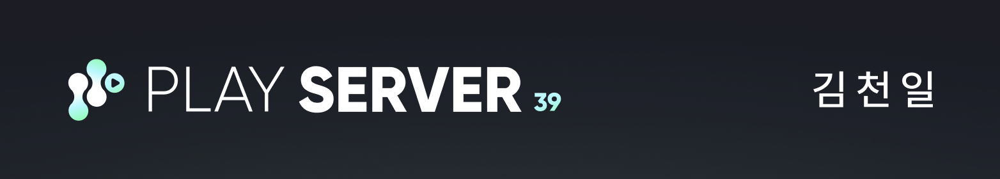

# SOPT 39th Server Part 🖥️

SOPT 39기 서버파트 개인 과제 저장소입니다. 8주 세미나 동안 배운 내용을 실습하고 기록합니다.

## 📚 Curriculum

| Week | Topic |
|------|-------|
| 1차 | Server Architecture & OOP |
| 2차 | Spring Framework & REST API |
| 3차 | Database & JPA (ORM) |
| 4차 | Deployment & Infrastructure |
| 5차 | 전 파트 합동 세미나 |
| 6차 | Spring Security & JWT Auth |
| 7차 | Maintenance & Performance Tuning |
| 8차 | Practical Insights & AppJam Kick-off |

## 🎯 Goal

원리를 이해하고 넘어가기. 
되는 이유와 안 되는 이유를 둘 다 설명할 수 있을 때까지!